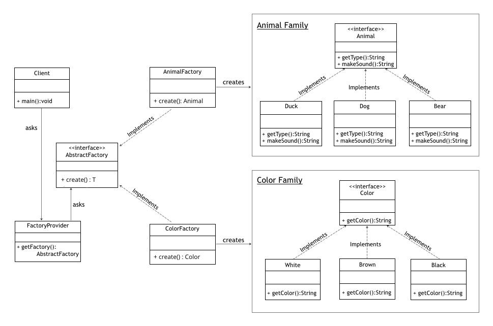

# 추상 팩토리 패턴
> 팩토리 패턴과 비슷해보이지만, 분명한 차이점이 존재합니다.

* 팩토리 메소드 패턴
    * 조건에 따른 객체 생성을 팩토리 클래스로 위임하여, 팩토리 클래스에서 객체를 생성하는 패턴
* 추상 팩토리 패턴
    * 서로 곤련이 있는 객체들을 통째로 묶어서 팩토리 클래스로 만들고, 이를 팩토리 조건에 따라 생성하도록 다시 팩토리를 만들어 객체를 생성하는 패턴
    

결론적으로 팩토리 메소드 패턴 앞에, 조건에 따른 팩토리를 하나 더 두어서 객체를 보다 캡슐화 하여 생성한다고 생각하면 된다.