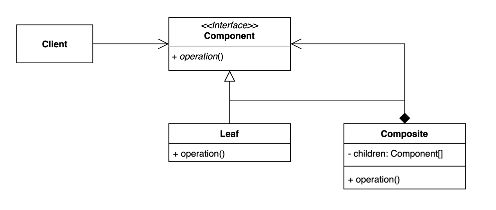
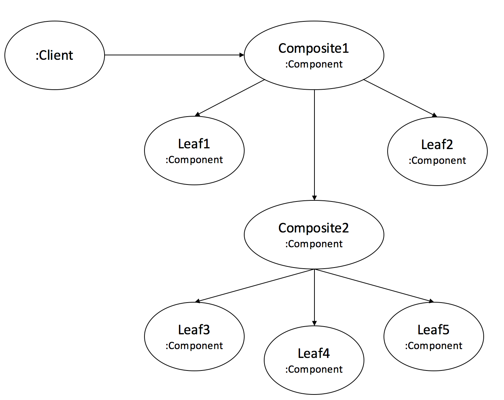

# Composite pattern 

## Composite 란?
OOP에서 Composite 는 하나 이상의 유사한 객체를 구성으로 설계된 객체로 모두 유사한 기능을 나타낸다.  
그룹을 조작하는 것처럼, 단일 객체를 조작할 수 있다.

예제에서는 Item에 `.getPrice()` Bag에 `.getPrice()`를 유사한 기능으로 두고 Item과 Bag의 `.getPrice()` 내부 구현을 달리 할 수 있다.  

## Composite 패턴이란?
컴포짓 패턴은 클라이언트가 복합 객체나 단일 객체를 동일하게 취급하는 것을 목적으로 한다.  
여기서 컴포짓의 의도는 **트리 구조**로 작성하여 전체-부분 관계를 표현하는 것이다.

트리 구조를 다룰때, 프로그래머는 리프 노드와 브랜치를 구별해야한다.  
여기서 코드는 많은 복잡성을 만들어 에러를 초래한다.  
이를 해결하기 위해 복잡하고 원시적인 객체를 동일하게 취급하기 위한 인터페이스(Component)를 작성할 수 있다.

## Composite pattern 사용하는 곳
복합 객체와 단일 객체의 처리 방법이 다르지 않을 경우, 전체 - 부분 관계로 정의할 수 있다.  
전체-부분 관계는 `Derectory`에 존재한다.  

    

1. Client 는 Component 인터페이스만을 사용한다. (컴포넌트들을 위한 추상화된 개념)
2. Leaf는 Component 메소드를 구현한다. (구체 클래스를 나타낸다)
3. Composite는 Component를 구현하는 Leaf들을 관리하기 위한 리스트가 존재한다. `ArrayList<Component>`
4. 또한 Leaf 들을 관리하기 위한 메소드도 존재한다 (`.addLeaf()`, `.removeLeaf()`)

아래의 그림을 참고하면 Composite가 Leaf를 관리한다는 느낌이 어떤 느낌인지 이해하기 쉬울 것이다.

    

그림을 통해 다시 강조하자면..  
`Composite`는 `Component`를 구현한 `Leaf`들을 관리하며 `Composite` 타입은 당연히 `Leaf`의 추상적 타입 `Component` 이다.  
`Client`에서 `Leaf` 객체가 다루는 **메소드를 호출할 수 없기 때문에 타입에 대한 안전성을 얻게 된다.**

## 정리
어떤 방식이 더 좋냐를 따지기에는 너무 많은 것이 고려된다.  
위키에서의 이론은 컴포짓 패턴은 타입의 **안정성보다는 일관성**을 더 강조한다고 한다.