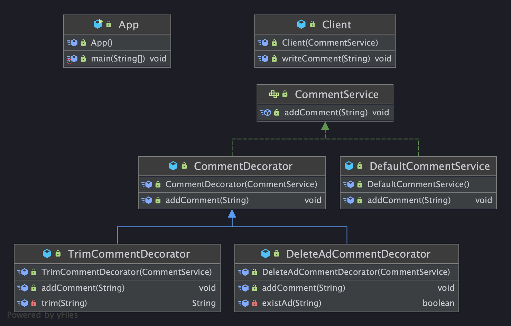

# Decorator pattern

## Decorator 란?
객체의 결합을 통해 기능을 동적으로 유연하게 확장 할 수 있게 해주는 패턴
* 즉 기본 기능에 추가할 수 있는 기능의 종류가 많은 경우에 각 추가 기능을 Decorator 클래스로 정의한 후 필요한 Decorator 객체를 조합함으로써 추가 기능의 조합을 설계하는 방식이다.
  * ex) A캐릭터가 찌르기, 구르기 skill을 가지고 있고 B캐릭터가 찌르기 구르기 뛰기 skill을 가지고 있다면 나열된 skill은 총 3가지 skill의 모든 조합은 8가지가 된다.
  * 데코레이터 패턴을 이용하여 필요 추가 기능의 조합을 동적으로 생성할 수 있다. (Decorator를 감싸고 감쌀 수 있다.)

## 장점과 단점

장점
* 새로운 클래스를 만들지 않고 기존 기능을 조합할 수 있다. (Decorator + Decorator)
* 컴파일 타임이 아닌 런타임에 동적으로 기능을 변경할 수 있다.

단점
* 데코레이터를 조합하는 코드가 복잡할 수 있다.

## 데코레이터 패턴 소개
Decorator pattern 은 아래와 같은 구조를 갖고 있다.  

<p align="center">
  
</p>

* App은 `CommentService`라는 Component를 가지고 있고 그 Component를 구현한 여러 Decorator를 갖고 있다.
* App을 통해 Client는 여러 FeatureService를 이용할 수 있다. (DIP 추상 타입에 의존해야 한다.)
* Feature의 세부사항은 요구사항이 변경됨에 따라 증가되거나 삭제된다. (OCP를 잘 지켜야 한다.)
* 부모 Decorator - 자식 Decorator 관계 때문에. 부모 Decorator와 다른 기능을 하게 하고자 하는 자식 Decorator 메소드에 대해서 **재정의 해야 한다. (`@Override`)**

## 예제 소개

### App 요구사항
1. App은 Client가 작성한 문자열에 쓸모없는 주석을 삭제해서 저장한다. (use trimming service)
2. App은 Client가 작성한 문자열에 광고를 삭제해서 저장한다. (use ad block service)
3. App은 1번 2번 모든 기능을 지원한다.

App.java
```java
public class App {
    // app의 기능을 true, false 로 설정
    private static final boolean isEnabledAdBlock = true;
    private static final boolean isEnabledTrimming = true;

    public static void main(String[] args) {
        CommentService commentService = new DefaultCommentService();

        if (isEnabledAdBlock){
            commentService = new DeleteAdCommentDecorator(commentService);
        }

        if (isEnabledTrimming){
            commentService = new TrimCommentDecorator(commentService);
        }

        Client client = new Client(commentService);
        client.writeComment("jyeonjyan's tech blog");
        client.writeComment("this is jyeonjyan's tech story... ..."); // if trimming == true, original != print
        client.writeComment("https://jyeonjyan.github.io/"); // if AdBlock == true, original != print

    }
}
```

### 문자열 요구사항
문자열을 댓글이라고 가정하면.  
App은 사용자의 댓글(Component)에 대해서 기능(Decorator)을 가지고 있다고 볼 수 있다.

위에 `App.java` 시나리오를 참고하면..
1. 기본적으로 CommentService는 `DefaultCommentService`의 기능을 갖는다. -> a 인스턴스
2. 필요한 기능에 맞게 `new ADecoratorService(a 인스턴스)` 기능을 지닌(a 인스턴스) 인스턴스를 넘긴다.