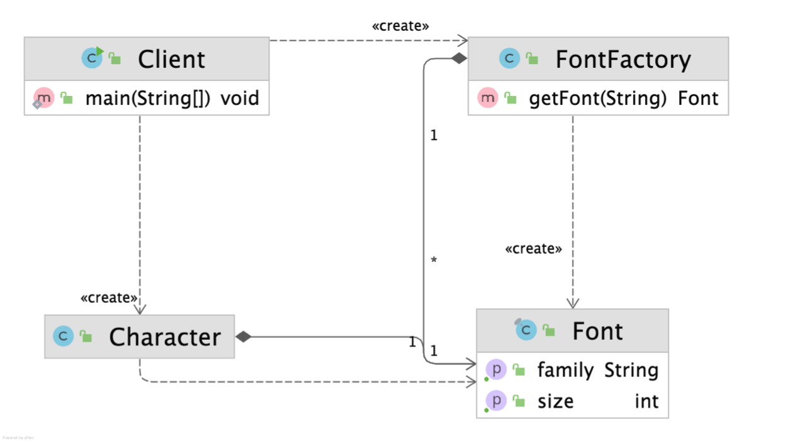
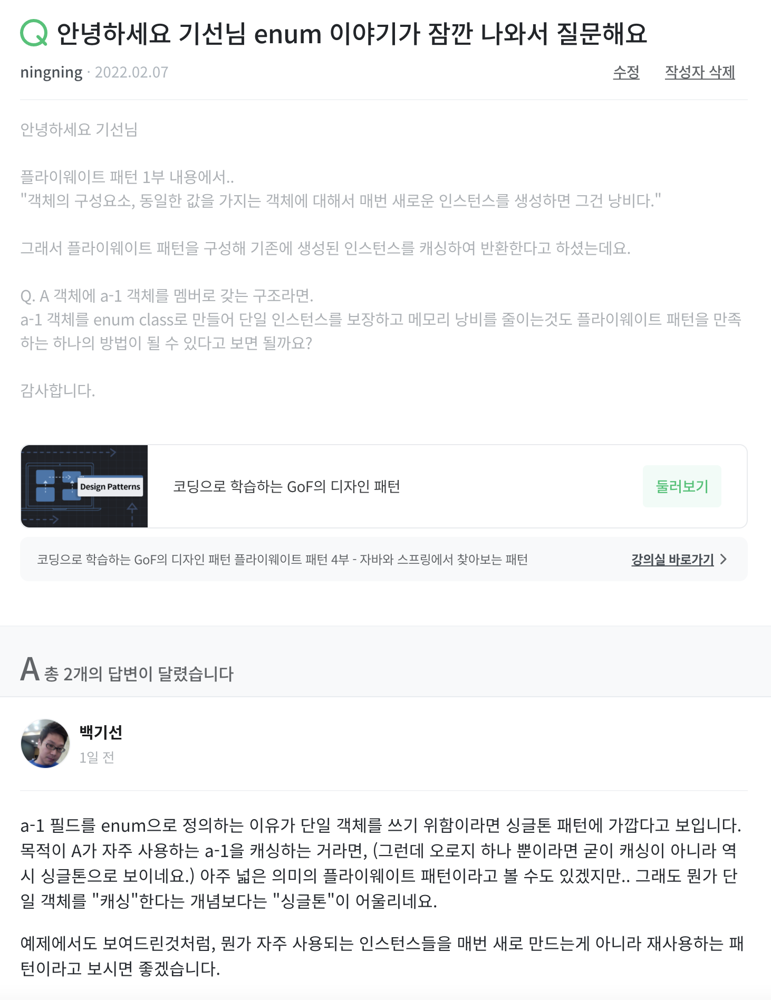

# 플라이웨이트 패턴
> 엄청나게 가벼운 패턴 이라고 직역할 수 있어요.  
> 어떤걸 가볍게 한다는거지? 라고 생각이 들거예요. 바로 메모리를 보다 효율적으로 관리하기 위한 패턴이예요. 

## 플라이웨이트 패턴 소개
메모리 관리를 통해서 `OutOfMemoryError`를 막아요.  
`OutOfMemoryError`는 메모리에서 오브젝트를 할당하기에 불충분한 상태일 때 반환해요.

아래 예제(Client.java)를 참고하면 다음과 같아요.

```java
public class Client {
    public static void main(String[] args) {
        Character charJ = new Character('j', "white", "D2Coding", 12);
        Character charY = new Character('y', "white", "D2Coding", 12);
        Character charE = new Character('e', "white", "D2Coding", 12);
        Character charO = new Character('o', "white", "D2Coding", 12);
        Character charN = new Character('n', "white", "D2Coding", 12);
    }
}
```

```java
public class Character {
    private char value;
    private String color;
    private String fontFamily;
    private int fontSize;

    public Character(char value, String color, String fontFamily, int fontSize) {
        this.value = value;
        this.color = color;
        this.fontFamily = fontFamily;
        this.fontSize = fontSize;
    }
}
```

`Character` 라는 여러 객체를 생성하기 위해 중복되는 멤버가 많아요.  
모든 Character 타입의 객체는 `String color`, `String fontFamily`, `int fontSize` 가 동일해요.  
> 16 bytes + 16 bytes + 4 bytes = 36 bytes, 총 36 bytes가 동일한 값을 지님에도 낭비되고 있어요.

## caching
> 중복되는 값의 객체에 대해서 caching 하면 좋을 것 같아요 !

우리가 구성할 App의 Diagram은 아래와 같아요.

<p align="center">
    
</p>

FontFactory에 caching을 담당하는 메소드를 넣을거예요.

```java
public class FontFactory {
    private final Map<String, Font> cache = new HashMap<>();

    public Font getFont(String font){
        if (cache.containsKey(font)){
            return cache.get(font);
        } else {
            String[] split = font.split(":");
            Font newFont = new Font(split[0], split[1], Integer.getInteger(split[2]));
            cache.put(font, newFont);

            return newFont;
        }
    }
}
```

if 
* key를 뒤져서 기존에 생성했던 `Font`가 있다면 해당 인스턴스(Value)를 리턴한다.  

else
* 사용자에게 `.getFont("white:D2coding:12")` 이렇게 받으면 생성자에 알맞게 값을 넣어 `Font` 인스턴스를 생성한다.  
* 해당 Font 인스턴스는 value와 함께 `HashMap`에 저장된다.

클라이언트는 아래와 같이 flyweight 하게 Character 객체를 생성할 수 있다.

```java
public class Client {
    public static void main(String[] args) {
        FontFactory fontFactory = new FontFactory();
        Character c1 = new Character('j', fontFactory.getFont("white:D2Coding:12"));
    }
}
```


## 디자인패턴은 목적에 따라서 관점에 따라서 달리 해석된다.
> 앞서 말했듯 flyweight 패턴은 caching이 목적이지 단일 인스턴스 반환이 목적이 아니다.

<p align="center">
    
</p>

* 메모리 낭비 막기 -> 단일 인스턴스 = 싱글톤 패턴
* 메모리 낭비 막기 -> caching = 플라이웨이트 패턴

이처럼. 어떤 문제를 어떤 목적으로 어떻게 풀지에 따라 알맞는 패턴을 사용 해야한다.